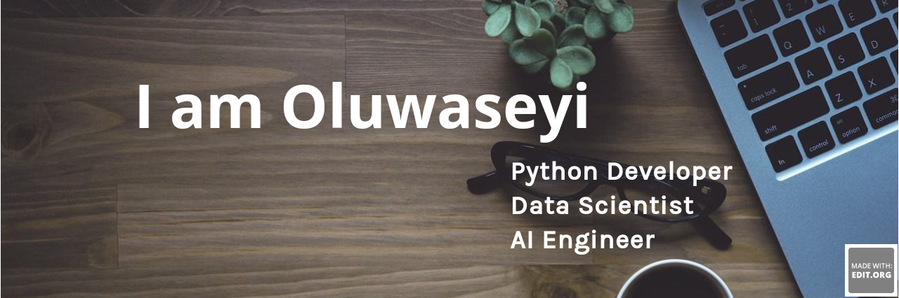

<h1 align="center">Hi 👋, I'm Abiola John Oluwaseyi</h1>
<h3 align="center">I am a Python Developer and Data Scientist</h3>
 
 

 

 

  

  

  

- 🌱 I’m currently learning **Machine Learning**

- 💬 Ask me about **Data Science**

- 📫 How to reach me **kdom2227@gmail.com**
- ⚡ Fun fact **My PC is my GF🤪🤪**

<h3 align="left">Connect with me:</h3>

<h3 align="left">Languages and Tools:</h3>

             

<h3 align="left">Support:</h3>

 
 
 
 

 
 
 
 
 
 

&nbsp;

 

